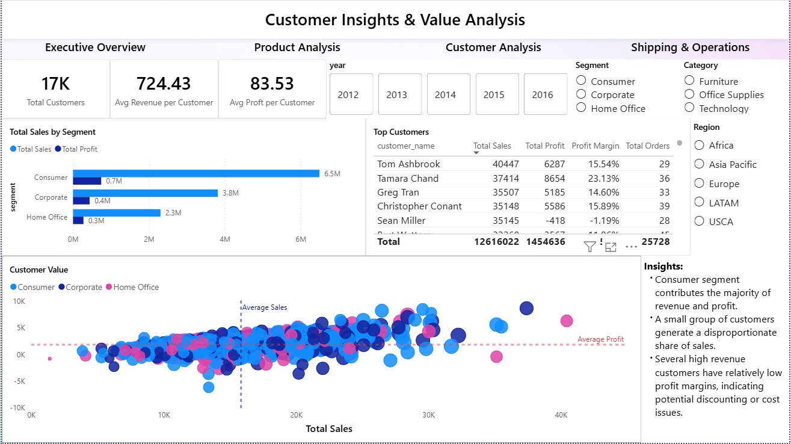
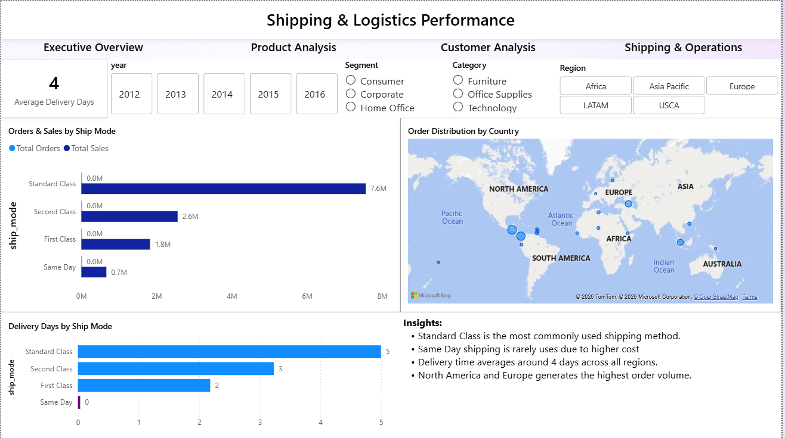

# Global Superstore Sales Analytics Dashboard

## Project Overview

This project presents an end-to-end Business Intelligence solution built using SQL and Power BI to analyze sales performance, customer behavior, product trends, and shipping operations using the Global Superstore dataset.

The dashboard helps businesses monitor key metrics, identify high-performing products and customers, analyze regional sales trends, and evaluate shipping efficiency to support data-driven decision making.

## Business Problem

Retail businesses need to monitor sales, profit, and operational performance across regions, products, and shipping modes.
This project was built to identify trends, top-performing categories, and areas needing improvement.

## Tools & Technologies

- SQL
- Power BI
- DAX
- Data Modeling (Star Schema)
- Data Visualization
- Business Intelligence

## Project Workflow

1. Data Collection
   - Used Global Superstore dataset containing sales, customer, and shipping data.

2. Data Cleaning & Transformation
   - Cleaned and prepared data using SQL.
   - Handled missing values and ensured data consistency.

3. Data Modeling
   - Designed a Star Schema with fact and dimension tables.

4. Data Analysis
   - Created DAX measures to calculate KPIs and performance metrics.

5. Visualization
   - Built interactive dashboards using Power BI.

6. Insights & Recommendations
   - Generated business insights and actionable recommendations.

## Data Model

A Star Schema data model was designed to optimize analytical queries.

Fact Table:
- Sales Transactions

Dimension Tables:
- Customer
- Product
- Geography
- Date
- Shipping Mode

This structure improves performance and enables efficient business analysis.

## Dashboard Pages

The Power BI report contains four analytical pages:

1. Executive Overview
   - Key KPIs such as Total Sales, Total Profit, Total Orders
   - Regional sales distribution

2. Product Analysis/Performance
   - Top performing products and categories
   - Profitability analysis

3. Customer Analysis/Insights
   - Customer segmentation
   - Revenue per customer analysis

4. Shipping & Operations
   - Delivery performance metrics
   - Shipping mode analysis

## Key DAX Measures

- Total Sales
- Profit Margin
- Sales YoY %
- Average Revenue per Customer
- Delivery Performance KPIs

## Key Insights

- Identified top-performing products and categories driving revenue.
- Discovered high-value customers contributing significantly to sales.
- Analyzed regional sales distribution to identify strong and weak markets.
- Evaluated shipping efficiency and delivery performance trends.

## Business Recommendations

Based on the analysis, the following actions are recommended:

- Focus on high-value customers by introducing loyalty programs and targeted marketing campaigns.
- Optimize underperforming regions by reviewing pricing strategies and product availability.
- Improve shipping efficiency by promoting faster shipping modes for high-priority customers.
- Increase profitability by prioritizing high-margin products and reducing discounts on low-margin items.

## Demo

- Download the PBIX file from the repository
- Open using Power BI Desktop
- Explore interactive dashboards using filters and slicers

  
## Dashboard Preview

### Executive Overview

### Product Analysis

### Customer Analysis

### Shipping & Operations

## Repository Structure

dataset/ – Dataset used in the project
docs/ – Additional documentation
powerbi/ – Power BI dashboard (.pbix file) 
screenshots/ – Dashboard preview images 
sql/ – SQL queries used for data preparation  

## Author

Nikita Parmar  
Aspiring Data Analyst / Power BI Developer

 
 

